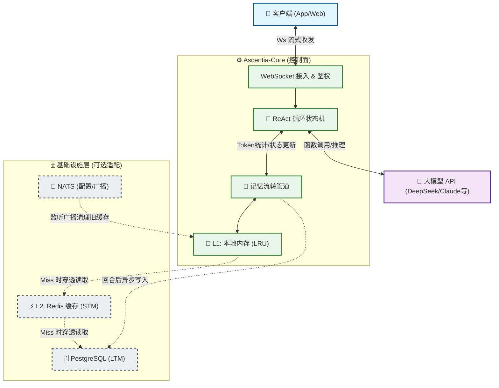

# ascentia-core

**是一个务实的 Go 语言 Agent 运行时底座 | 为大模型套上「控制面板」**

**语言：** [English](README.md) | **简体中文（本页）**

[CI](https://github.com/DaoTianji/ascentia-core/actions/workflows/ci.yml)
[License: MIT](LICENSE)

> GitHub **不会**按浏览器语言切换 README。请用上方链接，或打开 **[文档索引](docs/README.md)**（`docs/zh-CN`、`docs/en`）。

---

## 为什么做 Ascentia-Core？

在构建真正的 Agent 应用时，调通大模型 API 往往是最简单的一步。真正的挑战在于剩下的“脏活累活”：**多轮工具调用的死循环、Token 水位的膨胀、不同用户的上下文串车、以及长短期记忆的存取与去噪。**

**Ascentia-Core 就是为了接管这些痛点而生的运行时（Runtime）。** 它可以作为独立的中台进程部署在你的 API 网关或 BFF 之后。你只需接入任何兼容 OpenAI 格式的大模型，它就能为你代理整个对话的生命周期、记忆流转与护栏控制。

我们不追求大而全的 SaaS 全家桶，而是专注于提供一个**代码边界清晰、可长期稳定运行的工程底座**。

---

## 架构与设计哲学

本项目最大的特点是**核心引擎纯粹（Engine vs Adapters Split）**。
在 `pkg/agent_core` 中包含了纯粹的 Agent 状态机与处理逻辑，**零 HTTP/DB 依赖**；而所有的网络入口、数据库存储等适配器实现均隔离在 `internal/` 目录下。这使得本项目非常适合作为二次开发的参考架构。




---

## 核心特性

- **健壮的 ReAct 循环**：原生支持流式输出与多轮工具调用（Tool Use）。内置熔断机制（最大轮次限制、连续工具失败拦截），有效防止大模型陷入死循环。
- **完备的分层记忆体系**：不只是简单的“拼接历史消息”。
  - **短期记忆 (STM)**：基于 Redis 或内存，管理当前会话上下文。
  - **长期记忆 (LTM)**：基于 PostgreSQL，支持每次对话前的旁路召回（Side Query）注入提示词。
  - **异步反思链路**：回合结束后，利用小模型异步抽取关键信息；支持定时 **Dream 任务** 对记忆碎片进行合并与去噪。
- **严格的上下文纪律**：基于 Token 预算自动**压缩**历史对话记录，对过长的工具返回结果进行**截断**，杜绝上下文无限膨胀导致的 OOM 或天价账单。
- **原生思考流 (Thinking) 剥离**：针对具备深度思考能力的模型（如 DeepSeek-R1），引擎能在流式数据中精准剥离 `<thinking>...</thinking>` 过程，方便前端 UI 将“思考过程”与“实际回复”分层展示。
- **内建多租户安全**：数据流严格按 `user_id` + `agent_id` + `session_id` 维度进行隔离。

---

## 诚实的边界：本项目“不是”什么

为了保持架构的轻量与专注，Ascentia-Core **有所不为**：

1. **不是一个开箱即用的 SaaS 全家桶**：我们不提供前端 UI、注册登录页面或计费管理后台，这些业务逻辑需由你的应用层实现。
2. **不是 LangChain/Dify 的低代码替代品**：这不是一个面向非开发者的拖拽式 DSL，而是一个需要编译部署的后端常驻服务。
3. **不是企业级 API 网关**：虽然内置了基础的 JWT 鉴权和限流，但复杂的异构 IdP 映射、复杂的 WAF 防护策略，依然建议在你自己的前置网关中完成。

---

## 🚀 快速开始

### 1 环境要求

- **Go 1.24+**
- **大模型 API**：任意兼容 OpenAI 接口格式的模型服务。*(注：由于历史沿革，目前环境变量仍保留了 `ANTHROPIC_`* 前缀，详见 `.env.example`，后续会迭代兼容)*。
- **基础设施（生产环境建议）**：Redis、PostgreSQL、NATS。

### 2 本地运行

```bash
git clone [https://github.com/DaoTianji/ascentia-core.git](https://github.com/DaoTianji/ascentia-core.git)
cd ascentia-core

# 复制环境变量配置
cp .env.example .env
# 必填项：ANTHROPIC_BASE_URL, ANTHROPIC_API_KEY, ANTHROPIC_MODEL

# 启动引擎
go run ./cmd/ascentia-core/
```

默认 WebSocket 端点为：`ws://127.0.0.1:8080/ws`（可通过 `PORT` 与 `WS_PATH` 环境变量修改）。

> **💡 调试建议：**
> 当开启 `WS_AUTH_MODE=none` 时，可通过查询参数（如 `?user_id=123&agent_id=456`）直接建立连接并测试。生产环境的鉴权配置请务必参考 [WebSocket 安全指南](https://www.google.com/search?q=docs/zh-CN/WS_SECURITY.md)。

---

## 文档导航


| 核心文档                                                                             | 内容说明                               |
| -------------------------------------------------------------------------------- | ---------------------------------- |
| [📖 中英双语文档索引](https://www.google.com/search?q=docs/README.md)                    | 包含所有模块的详细说明指引                      |
| [💡 能力详解与设计理念](https://www.google.com/search?q=docs/zh-CN/CAPABILITIES.md)       | **推荐阅读**。详细阐述 Agent 叙事、记忆流转逻辑与反思机制 |
| [🏗️ 架构与数据流](https://www.google.com/search?q=docs/zh-CN/ARCHITECTURE.md)         | 模块边界、依赖关系与代码结构说明                   |
| [🔒 生产级 WebSocket 安全](https://www.google.com/search?q=docs/zh-CN/WS_SECURITY.md) | JWT 配置、网关鉴权与跨域策略                   |


---

## 路线图 (Roadmap)

作为一个持续演进的项目，我们近期的规划包括：

- 丰富接入层协议：复用 `runtime.Service` 支持 HTTP SSE 与 gRPC 入口。
- 支持可插拔的 JWT / OIDC claims 解析映射策略。
- 工具链插件化：支持动态注册与 MCP (Model Context Protocol) 协议。
- 推出配套的 **评测 Harness**：提供黄金数据集验证与自动化回归打分工具。
- 完善测试覆盖率与自动化 CI 流水线。

---

## 协议与致谢

- 许可证：[MIT License](https://www.google.com/search?q=LICENSE)
- 行为准则：[Contributor Covenant](https://www.google.com/search?q=CODE_OF_CONDUCT.md)
- 安全与漏洞报告：[SECURITY.zh-CN.md](https://www.google.com/search?q=SECURITY.zh-CN.md)

由 **DaoTianji** 维护。欢迎提交 Issue 探讨架构或通过 PR 贡献代码！