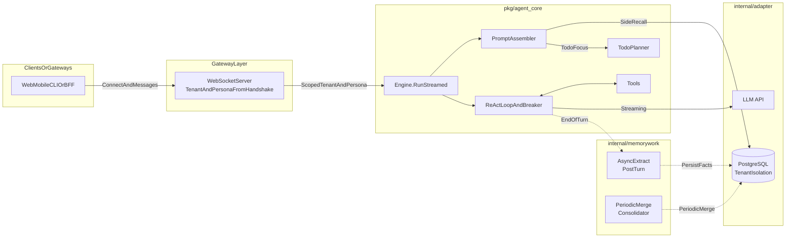

# Architecture

For a **feature-oriented** description (memory tiers, reflection jobs, harness framing), see **[CAPABILITIES.md](CAPABILITIES.md)**.

## 1. Role and goals

**ascentia-core** is a **multi-tenant agent runtime** (embeddable middleware): **ReAct-style tool loops**, **streaming chat**, **short-term session memory (STM)**, **optional long-term memory (LTM) in PostgreSQL**, **usage attribution**, and **async memory post-processing**. It does not assume a specific mobile client, admin framework, or control-plane product.

- **Primary contract**: **WebSocket + JSON** (you can also call `runtime.Service` / `agent_core.Engine` in-process for workers or batch jobs).
- **Identity / tenancy**: `user_id` / `agent_id` come from handshake parameters or your auth layer; IdP, RBAC, and billing live **outside** this service.
- **Design**: The **engine (`pkg/agent_core`)** is isolated from gateways and storage adapters.

---

## 2. Layers

### Layer 1 — Agent engine (`pkg/agent_core`)

Pure Go logic: **no** direct HTTP or database imports in this package.

- **Prompt assembly** — system rules, persona, time context, optional memory recall, Todo focus at the end.
- **ReAct loop** — `MaxTurns` and consecutive tool-failure circuit breaker.
- **Planner** — explicit Todo state machine and built-in cognitive tools.
- **Tenancy** — `TenantScope` (`UserID` + `AgentID`) through the stack.
- **Thinking** — optional `<thinking>` stream handling.

### Layer 2 — Adapters (`internal/adapter` & `integration`)

- **`adapter/llm`** — OpenAI-compatible streaming SSE → `ModelClient`.
- **`adapter/memory`** — Side-query recall from PostgreSQL before each turn.
- **`integration/pg`** — Persistence with SQL scoped by `session_id` / `user_id` / `agent_id`.

### Layer 3 — Memory jobs & gateway (`internal/memorywork` & `internal/gateway`)

- **Post-turn extraction** — async LTM writes.
- **Dream consolidator** — periodic merge/dedup of memories.
- **WebSocket gateway** — injects tenant and persona from the handshake.

---

## 3. Data and control flow

**Other languages:** [简体中文](../zh-CN/ARCHITECTURE.md)
