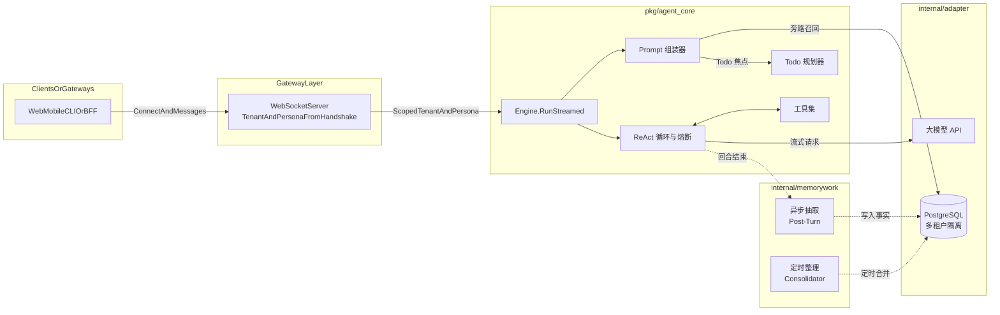

# ascentia-core 架构说明

以**功能与 harness 叙事**为主的说明见 **[CAPABILITIES.md](CAPABILITIES.md)**；本文侧重分层与数据流。

## 1. 定位与愿景

ascentia-core 是 **多租户智能体运行时 / 通用中台内核**：提供可嵌入的 **ReAct 工具循环、流式对话、会话 STM、可选 LTM（PostgreSQL）、用量归因与异步记忆加工**，不绑定某一移动端、某一后台框架或某一控制面产品。

- **对外契约**：以 **WebSocket + JSON** 为主入口（亦可在同进程内直接调用 `runtime.Service` / `agent_core.Engine` 做批处理、任务队列消费者等）。
- **身份与租户**：`user_id` / `agent_id` 由调用方通过握手参数或鉴权插件注入；具体 IdP、RBAC、计费策略属于**外围系统**职责。
- **实现上**借鉴了现代 AI 编程助手类产品的上下文压缩与记忆流转思路，将 **推理引擎 (`pkg/agent_core`)** 与 **协议网关、存储适配器** 分层隔离。

---

## 2. 核心架构分层

整个系统由内向外划分为三大核心层：

### 层一：智能体核心引擎 (`pkg/agent_core`)

纯粹的 Go 逻辑包，完全不依赖特定的 HTTP、数据库或业务通信协议。

- **动态组装提示词 (`prompt`)：** 拼图式组装，将系统规则、动态人设 (Persona)、时间上下文与旁路记忆组合，并将 Todo 任务焦点置于提示词末尾。
- **ReAct 循环与熔断 (`loop`)：** `MaxTurns` 与连续工具错误熔断，防止死循环消耗算力。
- **任务规划 (`planner`)：** 显式 Todo 状态机与内置认知工具。
- **租户隔离 (`identity`)：** `TenantScope`（`UserID` + `AgentID`）贯穿调用链。
- **思考流解析 (`thinking`)：** 可选分流 `<thinking>` 标签。

### 层二：物理适配器与基建 (`internal/adapter` & `integration`)

- **`adapter/llm`：** OpenAI 兼容流式 SSE → `ModelClient`。
- **`adapter/memory`：** 旁路检索（Side Query），对话前从 PostgreSQL 召回记忆。
- **`integration/pg`：** 持久化；SQL 层按 `session_id` / `user_id` / `agent_id` 隔离。

### 层三：异步记忆与网关 (`internal/memorywork` & `internal/gateway`)

- **回合后抽取 (`LLMExtractor`)：** 异步写入长期记忆。
- **Dream 整理 (`DreamConsolidator`)：** 定时合并、去重记忆。
- **WebSocket 网关 (`ws` & `runtime`)：** 握手参数注入租户与人设。

---

## 3. 数据与控制流向

**其它语言：** [English version](../en/ARCHITECTURE.md)
